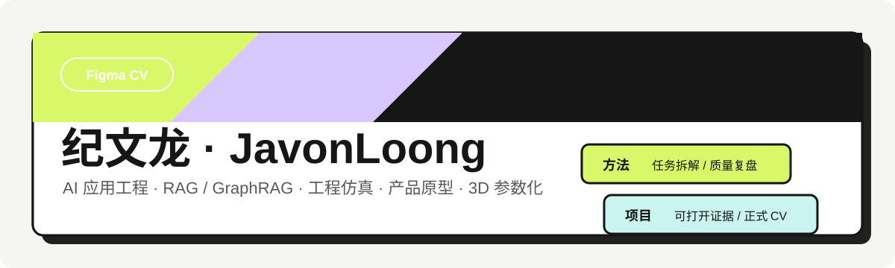

# 纪文龙 | JavonLoong

  

  <a href="https://javonloong.github.io/JavonLoong/">可视化主页</a>
  ·
  <a href="cv.html">正式 CV</a>
  ·
  <a href="resume/javon-formal-cv-cn.pdf">中文 PDF</a>
  ·
  <a href="resume/javon-formal-cv.pdf">English PDF</a>
  ·
  <a href="resume/javon-formal-cv-cn.tex">中文 LaTeX</a>
  ·
  <a href="resume/javon-formal-cv.tex">English LaTeX</a>
  ·
  <a href="https://github.com/JavonLoong">GitHub</a>
  ·
  电话：16639250335
  ·
  邮箱：jwl24@mails.tsinghua.edu.cn

## 个人定位

清华大学行健书院大二本科生，修读 **理论与应用力学 + 能源与动力工程双学位**。关注 **AI 应用工程、RAG / GraphRAG、工程仿真复刻、产品原型、3D 参数化建模和视觉表达**。

我把 AI 当成工程协作系统：先确认资料、边界与可复用工具，再用收敛的 plan、子 agent 实现、主 agent 审核和阶段性验证，把任务推进到可解释的交付。

## AI 与工程能力

| 能力方向 | 方法 |
| --- | --- |
| 工具与 Skill 取舍 | 先看前人成果和开源项目能否覆盖需求；能整合就整合，能微调就微调，确实有明确缺口时再从零自建工具 |
| 上下文工程 | 先建立收敛的整体 plan 和交付边界，再拆给多子 agent 实现；主 agent 负责审核、合并证据，并随时修正 plan 完成度 |
| AI 辅助编程 | 更倾向可干预、可解释的 AI 辅助编程；用 few-shot 少样本提示减少重复抽卡，并按场景调 temperature，在创意发散和严谨验证之间切换 |
| 上下文治理 | 进入下一步前主动压缩上下文或新开窗口，把无关试错与历史噪声隔离，减少上下文污染对判断和代码质量的影响 |

## 精选项目

| 项目 | 说明 | 展示 |
| --- | --- | --- |
| 动力装备领域 RAG/GraphRAG 智能知识问答系统 | 面向燃气轮机、风电设备等资料查阅难和问答无依据问题，负责文档解析/OCR 清洗、智能分块、向量入库、检索接口、GraphRAG 图谱能力、自动化评测与 Web 控制台；围绕 6098 页资料沉淀 593 条 chunk。 | [在线演示](https://javonloong.github.io/RAG/) · [源码仓库](https://github.com/JavonLoong/RAG) |
| 高空风能 AWES 与 COMSOL 仿真复刻 | 复刻典型飞行轨迹、系留绳张力、功率曲线和 pumping-cycle 能量账本；将 COMSOL 气动极线接入 Python 主仿真。 | 本地工程材料 |
| 智能电子产品创新实践课程项目 | AI Agent 与 AIGC 设计；完成需求拆解、交互流程、Agent 原型、混元 3D 模型生成与展示方案，获 Agent 设计二等奖和混元 3D 模型设计一等奖。 | [课程复盘视频](https://v.douyin.com/Bx2r1kX1LPo/) |
| 美育图像与 PPT 制作 | 素材筛选、生成图像、页面重绘、contact sheet 核对和 PPT 整理；强调审美判断与风格一致性。 | 本地汇报材料 |
| MoonCake Studio 月饼模具设计器 | 浏览器端 3D 参数化建模；支持边缘轮廓、传统花纹、中文刻字、图片浮雕、STL / GLB 导出。 | [在线演示](https://javonloong.github.io/Mooncake-Modle/) · [源码仓库](https://github.com/JavonLoong/Mooncake-Modle) |

## 正式线上 CV

当前 GitHub Pages 的根页面和 `cv.html` 都只展示同一套 Figma 风格正式 CV：[打开](https://javonloong.github.io/JavonLoong/)。

线上不保留其他风格入口或候选样式代码。

## 仓库内容

- `index.html`：Figma 风格正式 CV 根页面，适合 GitHub Pages。
- `README.md`：GitHub Profile README。
- `cv.html`：与根页面相同的 Figma 风格正式 CV 页面。
- `assets/profile-preview.svg`：README 头图。
- `assets/resume-data.js`：网页简历共用的结构化履历数据。
- `resume/javon-formal-cv-cn.pdf`：基于 `moderncv` 的中文 A4 两页正式 PDF CV，右上角已嵌入正式证件照。
- `resume/javon-formal-cv-cn.tex`：中文 PDF CV 的可编辑 LaTeX 源码。
- `resume/javon-formal-cv.pdf`：基于 `moderncv` 的英文 A4 两页正式 PDF CV，右上角已嵌入正式证件照。
- `resume/javon-formal-cv.tex`：基于 `moderncv` 官方模板改写的英文 LaTeX CV 源码。
- `resume/profile-photo.jpg`：由证件照按简历照片框比例裁剪生成，供网页 CV 与两份 PDF CV 共用。

## 内容参考

当前网页简历内容参考了以下本地 DOCX 文件：

- `D:/虚拟C盘/研学简历纪文龙.docx`
- `D:/虚拟C盘/纪文龙2024012842简历.docx`
- `D:/虚拟C盘/纪文龙.docx`
- `D:/虚拟C盘/文件/05-其他/新建文件夹 (3)/E起向未来--“九原青禾”电子系赴包头支教调研支队实践心得.docx`

`~$` 开头的文件是 Word/WPS 临时锁文件，不作为正文来源。
